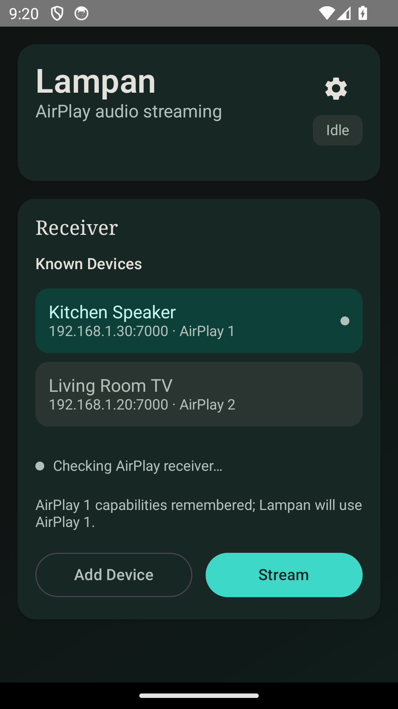

<div align="center">

# Lampan

### Stream Android audio directly to AirPlay speakers and TVs

No accounts, ads, subscriptions, or cloud relay—just your phone, your receiver,
and your local network.

[](https://github.com/obegron/lampan/releases/latest)

[](LICENSE)



</div>

Lampan captures playback audio from Android apps and streams it to AirPlay
receivers. It was built to make an **IKEA Symfonisk** useful as a general-purpose
speaker, and now supports AirPlay 1 speakers plus native encrypted AirPlay 2 on
compatible receivers such as Sony Bravia TVs.

## Highlights

- **System-wide playback capture** for apps that allow Android audio capture.
- **AirPlay 1** support, tested with IKEA Symfonisk/Sonos receivers.
- **Native AirPlay 2** pairing and encrypted realtime ALAC audio, tested with a
  Sony Bravia.
- **Automatic discovery** of AirPlay 1 and AirPlay 2 services, with duplicate
  receiver records merged into one device.
- **Known receivers** with remembered capabilities, protocol preference, secure
  password storage, and quiet identity/reachability checks.
- **Multi-receiver streaming (experimental)** across AirPlay 1, AirPlay 2, or a
  mixture of both using one shared RTP/NTP start timeline.
- **Background playback and volume control** while using other apps or with the
  phone locked.

## Quick start

1. Download the APK from the [latest GitHub release](https://github.com/obegron/lampan/releases/latest).
2. Install it on a phone running Android 10 or newer.
3. Put the phone and AirPlay receiver on the same Wi-Fi network.
4. Open Lampan, tap **Scan**, and select the receiver. You can also enter its IP
   address and port manually.
5. Tap **Stream** and approve Android's audio-capture prompt.
6. Start playback in another app.

For password-protected AirPlay 2 receivers, enter the receiver password when
requested. Lampan stores it only after successful authentication and protects it
with Android Keystore.

## Receiver compatibility

| Receiver path | Status |
| --- | --- |
| AirPlay 1 / RAOP | Tested with IKEA Symfonisk; preferred automatically on dual-protocol Sonos devices. |
| AirPlay 2 realtime ALAC + NTP | Tested with a Sony Bravia, including pairing, encrypted audio, and volume control. |
| AirPlay 2 receivers requiring PTP | Not available to an ordinary Android app because PTP uses privileged UDP ports 319/320. Lampan uses AirPlay 1 when the receiver also offers it. |
| Multiple receivers | Supported experimentally; different receiver buffers can still introduce a fixed audible offset. |

## Build variants

GitHub releases provide two APKs:

- **`lampan-vX.Y.Z.apk`** is the `standard` variant. It contains the complete
  streaming implementation and does not declare Android Notification Access.
- **`lampan-vX.Y.Z-nowPlaying.apk`** is the opt-in media variant. It can also send
  the active title, artist, progress, and available cover art to compatible
  AirPlay 2 receivers. It declares a notification-listener service and requires
  the user to grant Notification Access from Lampan's settings screen.

Both variants use the same application ID and signing key, so they update or
replace one another and cannot be installed side by side.

Build either development APK with:

```shell
./gradlew assembleStandardDebug
./gradlew assembleNowPlayingDebug
```

Outputs are written below `app/build/outputs/apk/standard/` and
`app/build/outputs/apk/nowPlaying/`. Android may require the signed GitHub build
to be uninstalled before installing a locally debug-signed build.

Run both unit-test variants with:

```shell
./gradlew testStandardDebugUnitTest testNowPlayingDebugUnitTest
```

## Permissions and privacy

- Playback capture uses Android's `MediaProjection` consent flow and audio-record
  permission.
- Nearby Devices access is used for receiver discovery on current Android
  versions.
- Notification Access exists only in the optional `nowPlaying` build and can be
  disabled independently inside Lampan.
- Receiver traffic stays on the local network. Lampan has no account system,
  analytics service, or cloud backend.

## Known limitations

- AirPlay buffering adds roughly two seconds of latency, making Lampan better for
  music, podcasts, and audiobooks than gaming or lip-synced video.
- DRM-protected apps can prohibit Android playback capture; Lampan cannot bypass
  that restriction.
- Native AirPlay 2 currently implements the realtime ALAC/NTP route, not buffered
  AAC/PTP playback.
- Mixed receiver groups remain experimental because different hardware can apply
  different fixed buffering delays.

## Project

- See the [changelog](CHANGELOG.md) for release history.
- Lampan requires Android 10 (API 29) or newer.
- Licensed under the [MIT License](LICENSE).
